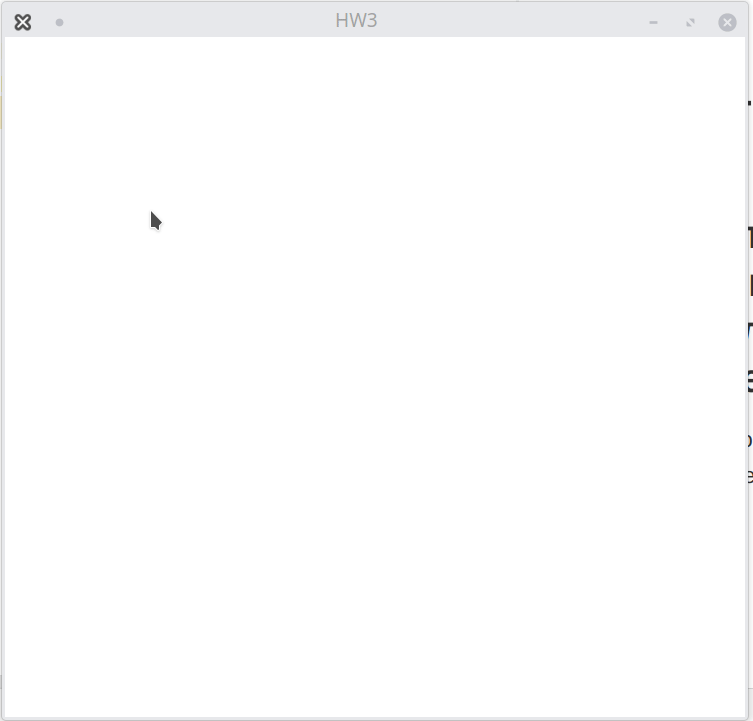

# ДЗ3 Алгоритм Кируса-Бека
## Выполнить процедуру отсечения отрезков произвольным многоугольником по методу Кируса-Бека.
Сначала ЛКМ строится многоугольник, по нажатию ПКМ достраивается последний отрезок.
После этого по ЛКМ строятся отрезки.

.
